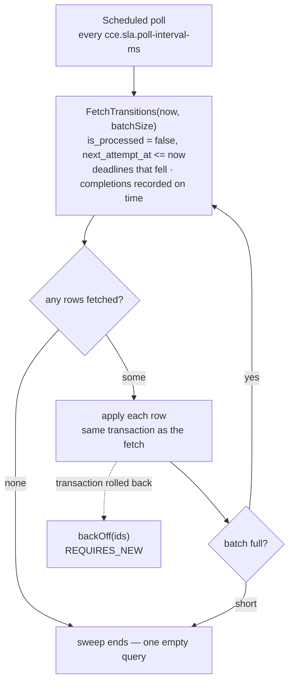

# Architecture & Design — Step SLA Service

> The time plane: what happens because a deadline passed or was beaten — never because an event
> arrived.

System-wide context — why the services are split, the shared schema, the SLA handoff contract — lives
in the **cce-common-util** repository's
[Architecture Overview](../../cce-common-util/docs/architecture-overview.md). This document covers
only what is specific to this service.

---

## Operational prerequisite — Event Replay

**This service must not run while the Matcher Service still has an event backlog to process.** Stop it
for the duration, and start it again only once that backlog is drained.

**Event Replay** is the term for any such run: events re-published to `cce.events.inbound` after a fix,
a historical backfill during migration, or a restart that leaves the Matcher Service far behind on its
consumer group. Use that term when coordinating — it is what this constraint is called.

Running both at once costs nothing in throughput. What it produces is **wrong verdicts that cannot be
withdrawn**.

### Why it matters

This service concludes that work has not happened by finding no completion on `step_instance`. That
inference is only sound once every event that could have completed the step has been matched. While
events sit unprocessed in Kafka, an absent completion does not mean the work was not done — it means
the Matcher Service has not reached it yet.

During an Event Replay the two do not merely race occasionally; they collide by default:

1. **Deadlines are anchored to clinical time, not to now.** The Matcher Service computes a step's
   `due_date` from the occurrence time of the event that triggered it, and writes `process_by` and
   `next_attempt_at` from that. Replaying a month-old event therefore creates a transition row whose
   deadline has *already passed* — so it is eligible on the very next poll, seconds later.
2. This service fetches that row, finds `step_status` is not `COMPLETED`, and writes `OVERDUE` (or
   `MISSED`) with a matching deviation — the first and fourth rows of the table in
   [§4](#4-what-the-applier-does).
3. The completing event is still in the backlog. When the Matcher Service reaches it, it sets
   `completed_at` to that event's own clinical timestamp — which is often *earlier* than `process_by`,
   meaning the work was in fact done on time.
4. **Nothing corrects step 2**, and each reason is deliberate:
   - `sla_status` writes are forward-only, and `MET` is written only over a null, so a step recorded
     `OVERDUE` can never become `MET`.
   - The `MET_CONDITION_REACHED` row Matcher writes when it finally reaches the event is applied
     against a step that is no longer null, so it records nothing.
   - The deviation row already exists and is de-duplicated, so it is not reconsidered.

What makes this a prerequisite rather than a preference is that nothing notices. A wrong verdict is not
an error the service reports — it is an ordinary-looking `sla_status` and deviation, and undoing it is
a manual data fix against every affected step.

### Why stopping is safe

Nothing is lost by holding this service off. That is not luck — it follows from the design:

- Transition rows are durable and are never cancelled, and `process_by` is immutable.
- The judgement never consults the wall clock, so a row applied hours or days late reaches **exactly**
  the verdict it would have reached on time. See [One gate](#one-gate-and-what-follows-from-it).
- `ORDER BY process_by ASC` takes the oldest deadline first, and batches drain within a cycle rather
  than one batch per interval, so a backlog accumulated during the replay clears in minutes.

The only cost of stopping is detection latency — nothing is judged while it is down. The cost of not
stopping is a permanently wrong clinical record.

The runbook — how to stop it, how to tell the Matcher Service is caught up, how to verify the drain,
and what to do if the sequence was missed — is in the
[Deployment Guide](deployment-guide.md#event-replay--sequencing-the-two-services).

## 1. Responsibility

Everything the schedule drives — and the one verdict that needs no schedule at all:

1. Pick up the `step_sla_state_transition` rows the Matcher Service scheduled, once they fall due, and
   judge whether each threshold was breached.
2. Sweep `step_instance` for completed steps that beat their `due_date`, with no row involved.
3. Write `step_instance.sla_status` — `OVERDUE` and `MISSED` from (1), `MET` from (2). This service is
   its only writer.
4. Record the resulting `OVERDUE` / `MISSED` deviations. On-time work breached nothing and records none.

The split between (1) and (2) is the shape of the whole service. A breach is measured against a
schedule, so a row has to come round for it. Timeliness is a statement about the step, answerable from
its own `completed_at` and `due_date` as soon as the completion lands — no threshold need fall for
`MET` to be known. §3 is how both are driven.

**What it does not do**: match inbound events, enrol patients, create or complete steps, manage
definitions, or evaluate intelligence actions on the deviations it records
([§5](#5-intelligence-on-deviation)). It uses no Kafka — nothing inbound reaches it and it publishes
nothing. `ORDER_VIOLATION` deviations stay with the Matcher Service, which detects them at completion
from the event itself.

## 2. Owns no tables

This service creates nothing. Flyway is **disabled**; `ddl-auto` is `validate`.

Enabling Flyway here would add an empty ledger and invite a second service to write DDL for tables it
does not own. Instead the service validates its JPA mapping against the schema at startup and fails
fast if what it needs is absent — which is also how a deployment-order mistake surfaces immediately
rather than as a runtime error hours later.

Deploy **last**. Table ownership and the full ordering rationale:
[Data Dictionary §3](../../cce-common-util/docs/data-dictionary.md#3-ownership).

## 3. The fetch-and-apply cycle

Every cycle runs **one sweep**, over `step_sla_state_transition`: fetch a batch of rows that have come
round, apply each, repeat until a batch comes back short. Every verdict this service reaches comes from
a row, `MET` included.

The three row types differ only in what they ask. `DUE_DATE_REACHED` and `MISSED_DATE_REACHED` are
deadlines: they become due when their threshold falls, and what they detect is a breach.
`MET_CONDITION_REACHED` is a condition already satisfied — Matcher writes it at the moment a completing
event lands before the step's due date, with `process_by` equal to that `completed_at` — so it is due
the instant it exists and the verdict is reached on the next cycle.

That last point is what makes one sweep possible. `MET` used to need a scan of `step_instance`, because
a schedule could only fire at a deadline and an early completion would otherwise read as null until a
due date weeks away. Scheduling the answer at the completion removes both the scan and the second code
path.

`MET` is written one row at a time rather than as a single `UPDATE`, like every other verdict, because
`step_instance_history` has to carry every `sla_status` transition and a set update would leave a gap
exactly where a step went on time.

The fetch lives on `SlaTransitionFetchRepository`, kept out of cce-common-util's shared read side
deliberately. Fetching rows to act on, and the pessimistic lock that comes with it, is this service's
alone; the shared repositories are the read side another service could reach for.

### Step by step

**Scheduled poll** — a Spring `fixedDelay` timer (5s by default, 15s under the `prod` profile; the delay runs from the end of one cycle to the start of the next) is the only thing that starts work in this
service. `poll()` catches everything `evaluateDue()` throws, because an exception escaping a
`@Scheduled` method stops the schedule. Every replica runs its own timer.

**`fetchTransitions(now, batchSize)`** — the only query that brings a transition row in. Fetches rows
where `is_processed = false AND next_attempt_at <= now AND process_by <= now`, ordered by `process_by`,
under `FOR UPDATE SKIP LOCKED` (a `PESSIMISTIC_WRITE` lock with the `-2` timeout hint Hibernate translates
to `SKIP LOCKED`). The `next_attempt_at` predicate is the real gate: it equals `process_by` when Matcher
writes the row, and a failure pushes it out so a retry is deferred without rewriting `process_by`, which
stays the immutable record of when the deadline fell. The `process_by <= now` bound is redundant with it
(`next_attempt_at` is never earlier), but paired with the partial index `idx_sslt_due_order` (on
`process_by`, a Matcher migration) it lets Postgres walk that index in `ORDER BY` order and stop after
one batch, instead of reading and sorting the whole due backlog to return the top `batchSize`.

**The fetch also fetches `step_instance`, under the same lock.** A step has up to three transition rows
(its two thresholds and its `MET_CONDITION_REACHED`), and locking `step_sla_state_transition` rows alone
only protects one row at a time — two replicas could each claim a different row of the *same* step and
judge it concurrently, racing on `step_instance.sla_status`. `JOIN FETCH t.stepInstance` brings
`step_instance` under the same `FOR UPDATE`/`SKIP LOCKED` semantics (Hibernate emits `... join
step_instance ... for no key update skip locked`, with no `OF` list), with no change to what the row's
eligibility means: a step is now held by exactly one replica for as long as that replica's batch
transaction runs. `MAX_BATCH_SIZE` (§7) bounds how long that hold can last. The same query hands the
applier every step it judges, so a batch is one query however large it grows, and a step's rows in one
batch share a single managed instance. It has to stay a *fetch* join: a bare `JOIN t.stepInstance`
selects nothing from the step and is pruned from the SQL, taking the step's lock with it.

**any rows fetched?** — zero is the steady state: one empty indexed query per interval, and the cycle
ends.

**apply each row** — per row: increment `attempts` (past five, the row is logged as an error every cycle
rather than failing quietly), take the step the fetch brought with it, decide whether the threshold was breached, write
`sla_status` forward-only, record the deviation if there is one, mirror the write into
`step_instance_history`, and mark the row processed with `processed_by`. §4 covers the judgement itself.
Each fetched id is also appended to a list the evaluator holds — plain memory rather than transactional
state, so it survives a rollback and the failure path knows which rows to defer.

`next_attempt_at` appears nowhere in that judgement. It is a fetch gate and nothing else — outside the
fetch predicate the only code that touches it is `backOff`, which writes it and never reads it. What
the apply reads is `transition_type` and `process_by` from the row, both immutable, and `step_status`,
`completed_at`, `sla_status` and `required_behavior` from the step. So *when* a row is applied cannot
change what it decides.

**batch full?** — a result that came back the full `cce.sla.batch-size` means there is probably more, so
the loop fetches again within the same cycle; a short batch means the backlog is drained.

**`backOff(ids)`** — the dashed edge, taken when `fetchAndApply` throws. The batch rolled back entirely,
so nothing was marked processed and no deviation was written. The evaluator counts the failed batch,
defers the ids it had fetched, and ends the cycle rather than starting another batch — whatever broke is
likely to break the next one too. See [Retry](#retry) for the backoff itself.

Three properties make this safe without any coordination machinery:

**The row lock is what reserves the row — and, since the fetch joins it, the step too.**
`FOR UPDATE SKIP LOCKED` means a row (or a step) locked by one replica is *invisible* to the others
rather than contended, so every replica can poll the same table concurrently. There is no lease table, no
heartbeat, and no leader election. A replica that dies mid-batch drops its connection, its locks release,
and the work is immediately available again — no lease expiry to wait out. The trade-off is that a step
tied to a row in the batch is held for the whole of that transaction, whether or not the row ends up
writing anything, which is why `cce.sla.batch-size` is capped (§7) rather than left unbounded.

**Fetch and apply share one transaction.** Fetching in one transaction and applying in another would
leave a window where a row is marked taken but not yet acted on, and a crash inside that window makes
the state permanent. Here there is no such window: either the row is applied and committed, or the lock
is released and nothing happened.

**Batches drain within a cycle.** The evaluator keeps fetching until a batch comes back short, so a
backlog that accumulated while the service was down clears in one cycle rather than one batch per
interval. `MAX_BATCHES_PER_CYCLE` (100) stops a pathological backlog from monopolising the thread.

`ORDER BY process_by ASC` means the oldest deadline is always handled first, so a backlog degrades by
latency rather than by dropping the most overdue work.

A `MET_CONDITION_REACHED` row needs no predicate of its own here. Its `process_by` is the
`completed_at` that satisfied it, which is already in the past when Matcher writes the row, so it is
fetched on the next cycle along with any deadline that has fallen. Ordering by `process_by` puts it in
clinical-time order with the rest — a completion recorded two weeks late, on a backdated event, is
settled before a deadline that fell this morning.

**Applying one**: the judgement is made here, from the step, not taken on the row's word. The row says
"this step looks on time, go and decide"; the applier checks `step_status = COMPLETED`,
`completed_at` and `due_date` both present, and `completed_at < due_date` strictly — work landing
exactly on the deadline did not beat it. If that still holds, `sla_status = MET` and the matching
`step_instance_history` row go through the same forward-only `writeSlaStatus` every other verdict uses.
No deviation is recorded: there is nothing deviant about work done on time.

If it does not hold — a step whose columns changed under the row, or a status already settled by a
deadline that got there first — the row records nothing and is consumed. That split is deliberate: the
Matcher schedules the question, this service answers it, and neither can write the other's column.

The step's own pending `DUE_DATE_REACHED` row is left alone. It is fetched when its schedule comes
round, finds the step settled, and is consumed then. It stays out of the backlog gauge in the meantime,
because that gauge counts only rows whose `next_attempt_at` has passed.

### One gate, and what follows from it

A row becomes ready when `next_attempt_at` passes. That is the whole of it — there is no second way in,
and nothing pulls a step's remaining rows forward because the step completed or was judged.

So a settled step keeps its unspent schedule until those dates arrive. A step recorded `MET` by its
`MET_CONDITION_REACHED` row, or `OVERDUE` by its due-date row, still holds a pending
`MISSED_DATE_REACHED` row; it
is fetched when its date comes round, finds the threshold kept or the status already past it, records
nothing, and is consumed. The row is disposed of late rather than early, and the step's `sla_status` is
the same either way.

**Why not fetch a settled step's rows early?** Because it would buy nothing and cost the retry
contract. A row's verdict is a function of `process_by` and the step's own columns, so taking one ahead
of its deadline produces exactly the outcome the deadline would have produced later — the write moves
earlier, nothing else changes. And a query for such rows has to ask for `next_attempt_at > now`, which
is precisely the state `backOff` puts a failed row into: it would re-fetch on the next cycle a row the
back-off had just deferred, so the exponential interval would never take effect for the rows it covered.
One gate, honoured, is both simpler and more correct.

### Why a driver and an applier

`SlaTransitionEvaluator` polls and loops; `SlaTransitionApplier` holds the `@Transactional`
boundary. They are separate beans because `@Transactional` takes effect through the Spring proxy — a
scheduled method calling a transactional method **on itself** bypasses the proxy entirely and runs
with no transaction at all. Splitting them is what makes the annotation real.

The evaluator's `poll()` never propagates: a failed cycle must not kill the scheduler thread.

## 4. What the applier does

This service is the **only writer of `step_instance.sla_status`**. The Matcher Service records that a
step completed and when — it never judges whether that was timely — so there is no question here of
overwriting what another service decided. A step's `sla_status` is null until a threshold falls due and
this service judges it.

The judgement compares `step_instance.completed_at`, the clinical occurrence time of the completing
event, against the threshold the row stands for. The wall clock is not consulted: all that remains to
ask is whether the work had happened by then.

**A breach is measured against the row's `process_by`.** `OVERDUE` and `MISSED` exist because a
deadline fell, and the row carries the deadline.

**`MET` is measured against the step's `due_date`.** A `MET_CONDITION_REACHED` row says work was
recorded early; the applier confirms it against `step_instance.due_date`, not against the row's own
`process_by`, which holds the `completed_at` that prompted it. So a *due-date* row whose threshold was
kept still records nothing — the step's `MET` row is where that verdict lives, and it was reached when
the work landed.

`due_date` and the `DUE_DATE_REACHED` row's `process_by` normally hold the same instant — the Matcher
writes both from one value in one transaction — but they answer to different owners, and only
`due_date` is a statement about the work.

| Row | Step when applied | `sla_status` | Deviation |
|---|---|---|---|
| `DUE_DATE_REACHED` | not completed | `OVERDUE` | `OVERDUE` |
| `DUE_DATE_REACHED` | `completed_at >= process_by` | `OVERDUE` | `OVERDUE` |
| `DUE_DATE_REACHED` | `completed_at < process_by` | *unchanged* | — |
| `MISSED_DATE_REACHED` | not completed | `MISSED` | `MISSED` |
| `MISSED_DATE_REACHED` | `completed_at >= process_by` | `MISSED` | `MISSED` |
| `MISSED_DATE_REACHED` | `completed_at < process_by` | *unchanged* | — |
| `MET_CONDITION_REACHED` | `completed_at < due_date` | `MET` | — |
| `MET_CONDITION_REACHED` | anything else | *unchanged* | — |

A step marked `COMPLETED` with no `completed_at` is treated as a breach — the row is better evidence
than a missing timestamp, and letting it pass would hide the gap instead of surfacing it. That rule
needs no clock to justify it: a row is only ever applied once its own threshold has passed, so a step
recorded complete with no timestamp is late by definition.

### Keeping a threshold is not the same as meeting an SLA

The two *unchanged* table rows are worth being careful about. A step completed between its thresholds
breached neither the missed date nor — if it landed before `process_by` — the due-date row's schedule.
Neither is a statement that it was on time.

This is why *these* rows never write `MET`. "Did not breach this threshold" and "met its SLA" are
different claims, and a row that reported the first as the second would relabel a late completion as on
time. Timeliness is asked once, on its own row, against the step's `due_date` — and a step completed
between its thresholds never gets such a row, because Matcher only writes one for work that landed
before the due date.

A step with no `due_date` is therefore never recorded `MET`. It has no deadline to have beaten, so no
`MET_CONDITION_REACHED` row is written for it and its `sla_status` stays null, which is what null means.
In practice that is a row carried over from 1.x: every step the current Matcher creates is given a due
date, a step created from its own trigger being stamped with the moment it was created.

Writes are **forward-only** for the same reason. `MET` and `MISSED` are settled outcomes, and `OVERDUE`
must never replace `MISSED` — which is exactly what a retry applying a step's two rows out of order
would otherwise do.

### Optional steps

**Only mandatory steps have deadlines.** A deadline is the point at which work the protocol *required*
has not been recorded, so only a step the protocol required can breach one. That is now enforced where
schedules are written rather than where they are judged:

* The Protocol Service **rejects a PlanDefinition** whose optional action declares `tolerance-days`
  (`PlanDefinitionParser.validateOptionalStepDeadlines`). An author who wants the deadline declares
  `requiredBehavior: "must"`.
* The Matcher Service **writes no `step_sla_state_transition` row** for an optional step, whatever
  thresholds it was created with (`StepSlaScheduleService.schedule`). This is the enforcement that
  holds for protocols loaded before the check existed.

Mandatory is `requiredBehavior == "must"` and nothing else — an absent value states no requirement, so
it is optional exactly as `could` is. `RequiredBehavior.isMandatory` is the single definition, shared by
progressive instantiation, SLA scheduling and the judgement here, so a step cannot be required by one
rule and optional by the next.

A row for an optional step can therefore only be one written before those rules — and the Matcher's `V4`
migration deleted those, including the ones `V2`'s upgrade backfill seeds, so the table holds mandatory
rows only. The applier still **consumes** any it meets, recording no `sla_status` and no deviation
whatever the row stands for, and logs it as a stale schedule. That check sits ahead of the type dispatch, so it covers `MET_CONDITION_REACHED` as well as
the two deadlines: the rule is enforced where rows are written *and* where they are judged, so neither
side alone has to be trusted.

`MET` follows the same rule, now that it comes from a row too: Matcher writes no
`MET_CONDITION_REACHED` for an optional step and the applier would decline one anyway, so an optional
step reaches no SLA verdict at all and its `sla_status` stays null. That is the consequence of having no deadline — there is no due date it can be
said to have beaten, just as there is none it can breach.

### What it does not write

The applier **never writes `step_status`**. That column belongs to the Matcher Service — see
[Architecture Overview §4](../../cce-common-util/docs/architecture-overview.md#4-step-status-and-sla-status).

Every `sla_status` write is mirrored into `step_instance_history` through the shared
`StateTransitionHistoryWriter`, in the same transaction. Without it the time-driven half of a step's
timeline would be missing from that table and from the CDC stream downstream of it: a step that went
overdue and was never completed would show only its creation.

### Retry

A batch whose transaction rolled back is backed off rather than lost: `attempts` is incremented and
`next_attempt_at` pushed out by `2^attempts` seconds, capped at `cce.sla.max-backoff-seconds`. The
backoff write runs `REQUIRES_NEW`, because the transaction it is recovering from has already rolled
back — joining it would roll the backoff back too, and the row would be retried immediately in a tight
loop.

Nothing re-fetches a deferred row ahead of its `next_attempt_at`, so the interval the backoff computes
is the interval that actually elapses. A second fetch path that reached rows by their step's state would
quietly undo that, because a deferred row is exactly a row whose `next_attempt_at` is in the future.

`processed_by` records which replica applied each row, so a misbehaving instance is identifiable from
the data.

## 5. Intelligence on deviation

Not part of this service yet. A breach records its deviation ([§4](#4-what-the-applier-does)) and
nothing further happens: no intelligence action is evaluated and nothing is published.

cce-common-util still ships that machinery — `IntelligenceActionEvaluator` and the Kafka producer it
publishes through — so the application class keeps it out explicitly. It filters the library's
`intelligence` and `kafka` packages from component scanning, and excludes Kafka auto-configuration
because spring-kafka still reaches the classpath through that library. Without both, those beans would
be created anyway, with a Kafka producer to back them. `ApplicationContextTest` fails if either
exclusion is lost.

## 6. Observability

| Metric | Type | Meaning |
|---|---|---|
| `cce.sla.transitions.due` | gauge | rows the next cycle would fetch: unprocessed, with `next_attempt_at` already passed — the primary health signal |
| `cce.sla.transitions.applied` | counter | `sla_status` writes that advanced a step — a breach, or a completion confirmed `MET` |
| `cce.sla.transitions.skipped` | counter | rows that asked for a verdict and got none — an optional step's schedule predating the mandatory-only rule, or a step already settled. An anomaly signal, so it sits near zero; a deadline row consumed for the ordinary reason (the work beat its threshold) is not counted |
| `cce.sla.evaluator.cycles` | counter | polling cycles run |
| `cce.sla.evaluator.batches.failed` | counter | batches that rolled back and were backed off |

The gauge counts only what is **ready to process** — it carries `fetchTransitions`'s own predicate,
so it reports what the next cycle will actually take. A gauge over every unprocessed row would fold in
the entire future schedule, so it would track enrolment volume rather than lateness and could never sit
near zero.

The gauge is the one to alert on. It sits near zero in a steady state and rises when transitions fall
due faster than they are applied — which is the failure this service can actually have. A sustained
rise means the sweep is not keeping up; a rise with `batches.failed` climbing alongside means rows are
failing and backing off rather than the sweep being slow.

`cycles` incrementing with everything else flat is the normal idle signature, and distinguishes "no
work to do" from "scheduler stopped".

## 7. Scaling

Scales with the **backlog**, not with inbound traffic — that is the reason it is a separate service.
A burst of clinical events cannot delay the SLA sweep, and a large SLA backlog cannot delay event
processing.

Replicas are safe to add freely: the fetch-and-apply cycle needs no coordination, and adding an instance
adds throughput directly. The limiting factor is database contention on `step_sla_state_transition` and,
since the fetch now joins it, `step_instance` — not anything in the application.

`cce.sla.batch-size` trades transaction length against round trips, and now also against how long a
batch's steps are held from Matcher: the fetch locks every step tied to a row in the batch for the whole
transaction, not just the instant `sla_status` is written, so a larger batch means both a longer hold and
more steps held.

`SlaTransitionApplier.MAX_BATCH_SIZE` caps this at 100, enforced by refusing to start above it. Measured
end to end on a 20-million-row `step_instance` table, batches of 250–350 rows reliably finished under the
5-second poll interval; 450–550 straddled it with real run-to-run variance (450 rows ranged 4.5–9.7
seconds across repeated runs, depending on whether that run's steps happened to be cache-resident); 550
and above was over 5 seconds more often than not. The fetch itself stays in single-digit milliseconds
regardless of table size — the cost is the apply loop, a single Hibernate session accumulating dirty
state across the whole batch, which is why it does not scale smoothly with batch size. 100 sits well
below where this starts, with margin for the variance observed. Raising it without re-measuring on
production-scale hardware risks holding `step_instance` locks, and blocking Matcher's writes to those
steps, for several seconds per batch.

### Connections

Each replica needs one connection to do its work: a single scheduler thread runs one batch at a time,
and `backOff` only runs after a failed batch has rolled back and released its connection. The pool
(`DB_POOL_SIZE`, default 3, minimum idle 1) leaves room for the two things that can overlap a batch — a
Prometheus scrape running the `cce.sla.transitions.due` count, and the actuator health check. Adding
replicas adds connections at that rate, so size the database's connection limit as replicas × pool size.

### Write batching

Every write a batch makes is sent with JDBC batching (`hibernate.jdbc.batch_size: 25`, with
`order_updates` and `order_inserts`, the same values as Matcher):

| Write | How it stays batchable |
|---|---|
| `step_sla_state_transition` UPDATE (attempts, processed), one per row | dirty-checked, flushed together |
| `step_instance` UPDATE (`sla_status`), one per verdict | dirty-checked, flushed together |
| `step_instance_history` INSERT, one per verdict | ids drawn 50 at a time from `step_instance_history_id_seq` (pooled optimizer), so no insert has to run early to read its key back |
| `deviation` INSERT, one per breach | the applier collects the batch's breaches and hands them to `DeviationRecorder.recordDeviations` once, after the loop: one existence query for the whole batch, then all new rows queued together |

Checked against Postgres 16 with 30 breaches in one batch: each of the four writes went out as two JDBC
batches (25 + 5), with one deviation lookup and two `nextval` calls, where it used to be roughly 90
single-statement round trips.

Two things this depends on:

- **The history sequences must step by 50.** Matcher's `V6` migration sets this. Hibernate compares a
  sequence's increment with the entity's allocation size at startup and refuses to start if they differ,
  so any service on the new `cce-common-util` (Matcher, this service, Protocol, Compliance) must start
  after `V6` has run — deploy Matcher first, as for every schema change. History ids then stop arriving
  in insert order across writers; nothing orders by them (reconstruction uses `changed_at`).
- **Deviations are recorded at the end of the batch, not as each breach is found.** Nothing in the loop
  reads a deviation back, and it is the same transaction, so no verdict changes. The
  `deviation_step_type_key` unique constraint is still the backstop against a concurrent insert.

The measurements behind `MAX_BATCH_SIZE` above were taken before batching; the apply loop they found
dominant should now be cheaper. **Follow-up:** re-measure the fetch-and-apply path on the
20-million-row dataset and revisit `MAX_BATCH_SIZE` from the new numbers.

## 8. Security

No authentication at the application layer, and no application API: the only HTTP surface is
actuator's health and metrics endpoints, which should not be exposed beyond the cluster. The service
performs no writes on behalf of a caller — every write it makes is driven by the scheduler, from rows
another service created.
