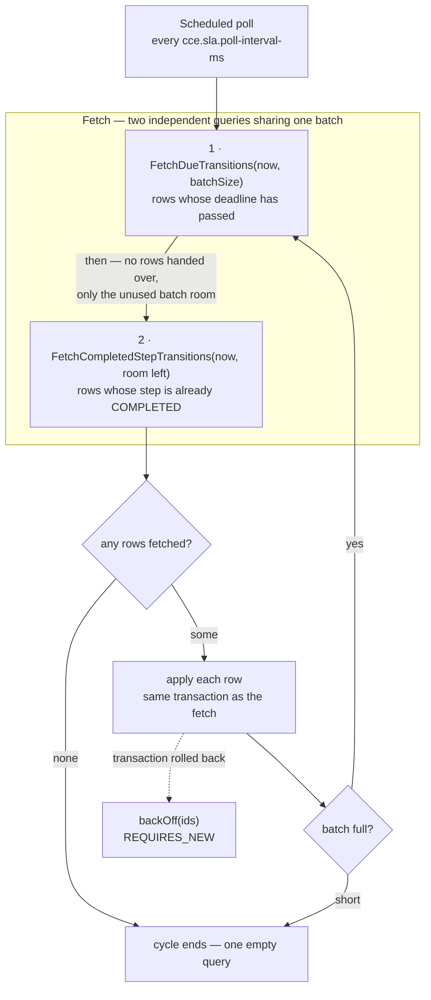

# Architecture & Design — Compliance Service

> The time plane: what happens because a deadline passed, not because an event arrived.

System-wide context — why the services are split, the shared schema, the SLA handoff contract — lives
in the **cce-common-util** repository's
[Architecture Overview](../../cce-common-util/docs/architecture-overview.md). This document covers
only what is specific to this service.

---

## 1. Responsibility

Everything driven by **time passing**:

1. Pick up the `step_sla_state_transition` rows the Matcher Service scheduled, once they fall due.
2. Write `step_instance.sla_status` — this service is its only writer.
3. Record the resulting `OVERDUE` / `MISSED` deviations.
4. Evaluate the intelligence actions those deviations trigger, and publish them.

It also exposes a read API over `intelligence_event_log`.

**What it does not do**: match inbound events, enrol patients, create or complete steps, or manage
definitions. It has no Kafka consumer — nothing inbound reaches it. `ORDER_VIOLATION` deviations stay
with the Matcher Service, which detects them at completion from the event itself.

## 2. Owns no tables

This service creates nothing. Flyway is **disabled**; `ddl-auto` is `validate`.

Enabling Flyway here would add an empty ledger and invite a second service to write DDL for tables it
does not own. Instead the service validates its JPA mapping against the schema at startup and fails
fast if what it needs is absent — which is also how a deployment-order mistake surfaces immediately
rather than as a runtime error hours later.

Deploy **last**. Table ownership and the full ordering rationale:
[Data Dictionary §3](../../cce-common-util/docs/data-dictionary.md#3-ownership).

## 3. The fetch-and-apply cycle

Every cycle does the same two things: **fetch** a batch of `step_sla_state_transition` rows that are
ready to be processed, then **apply** them.

Read the two fetches in the diagram as **independent queries, not a pipeline**. They read disjoint sets
of rows and neither one uses the other's results. They run one after the other only because they share a
single batch: the first takes what it needs, the second asks for whatever room is left. Nothing in the
second query depends on *what* the first found — only on *how many*.

Both queries live on `SlaTransitionFetchRepository`, and both return transition rows rather than steps
— which is what the names say.

### Step by step

**Scheduled poll** — a Spring `fixedDelay` timer, default 5s, is the only thing that starts work in this
service. `poll()` catches everything `evaluateDue()` throws, because an exception escaping a
`@Scheduled` method stops the schedule. Every replica runs its own timer.

**1 · `fetchDueTransitions(now, batchSize)`** — fetches rows where `processed = false AND next_attempt_at <=
now`, ordered by `process_by`, under `FOR UPDATE SKIP LOCKED` (a `PESSIMISTIC_WRITE` lock with the `-2`
timeout hint Hibernate translates to `SKIP LOCKED`). The predicate selects on `next_attempt_at` rather
than `process_by`: the two are equal when the Matcher Service writes the row, and a failure pushes
`next_attempt_at` out so a retry is deferred without rewriting `process_by`, which stays the immutable
record of when the deadline fell. The partial index `idx_sslt_due` covers exactly this predicate, so the
scan touches only the unprocessed backlog.

Note what it does *not* read: this is a single-table query with no join to `step_instance`, so it knows
nothing about whether the step completed. Eligibility here is purely "this row's gate has passed"; what
the row *means* is decided later, in the apply.

**2 · `fetchCompletedStepTransitions(now, room left)`** — runs only if the first query left room in the batch, and
asks for exactly that much. It fetches rows whose step is already `COMPLETED` with a `completed_at` and
an `sla_status` still null or `OVERDUE`, and excludes the rows the first query already takes
(`next_attempt_at > now`) — which is what keeps the two sets disjoint. These rows are judged ahead of
their deadline; the reason is below. A step marked `COMPLETED` with no `completed_at` is invisible here
and reachable only through the first query — there is no timestamp to judge it early by.

**any rows fetched?** — the size of the two results combined. Zero is the steady state: one empty
indexed query per interval, and the cycle ends.

**apply each row** — per row: increment `attempts` (past five, the row is logged as an error every cycle
rather than failing quietly), load the step, decide whether the threshold was breached, write
`sla_status` forward-only, record the deviation if there is one, mirror the write into
`step_instance_history`, and mark the row processed with `processed_by`. §4 covers the judgement itself.
This is where `completed_at` is read, and it is one code path with no branch on which query fetched the
row — which is why applying a row early and applying it late give the same verdict. Each fetched id is
also appended to a list the evaluator holds — plain memory rather than transactional state, so it
survives a rollback and the failure path knows which rows to defer.

**batch full?** — a result that came back the full `cce.sla.batch-size` means there is probably more, so
the loop fetches again within the same cycle; a short batch means the backlog is drained.

**`backOff(ids)`** — the dashed edge, taken when `fetchAndApply` throws. The batch rolled back entirely,
so nothing was marked processed and no deviation was written. The evaluator counts the failed batch,
defers the ids it had fetched, and ends the cycle rather than starting another batch — whatever broke is
likely to break the next one too. See [Retry](#retry) for the backoff itself.

Three properties make this safe without any coordination machinery:

**The row lock is what reserves the row.** `FOR UPDATE SKIP LOCKED` means a row locked by one replica is
*invisible* to the others rather than contended, so every replica can poll the same table concurrently.
There is no lease table, no heartbeat, and no leader election. A replica that dies mid-batch drops its
connection, its locks release, and the work is immediately available again — no lease expiry to wait
out.

**Fetch and apply share one transaction.** Fetching in one transaction and applying in another would
leave a window where a row is marked taken but not yet acted on, and a crash inside that window makes
the state permanent. Here there is no such window: either the row is applied and committed, or the lock
is released and nothing happened.

**Batches drain within a cycle.** The evaluator keeps fetching until a batch comes back short, so a
backlog that accumulated while the service was down clears in one cycle rather than one batch per
interval. `MAX_BATCHES_PER_CYCLE` (100) stops a pathological backlog from monopolising the thread.

`ORDER BY process_by ASC` means the oldest deadline is always handled first, so a backlog degrades by
latency rather than by dropping the most overdue work.

### Two reasons a row is ready to process

A row's deadline passing is one. The other is its step already being `COMPLETED` with a `completed_at`:
the judgement compares that timestamp against the step's deadline and never consults the clock, so
once the completion is recorded the outcome is fixed and the schedule coming round later would only
confirm it.
Applying it now is the same verdict, sooner — which is what keeps an on-time completion from reading as
a null `sla_status` until its due date, weeks away for a step recorded early.

The two queries are disjoint (`next_attempt_at > now` on the second), so no row is applied twice, and
they share the batch: deadline-driven rows first, the second query asking only for the room left. A full
first batch skips the second query entirely — fallen deadlines are the pressing work, and the evaluator
comes back for the rest in the next cycle.

The second query is cheap because `idx_step_instance_completed_unjudged` covers exactly the
completed-but-unsettled set, which a sweep empties. Driving it the other way — scanning pending
transitions and checking each step — would mean walking the entire future schedule every few seconds.

### Why a driver and an applier

`SlaTransitionEvaluator` polls and loops; `SlaTransitionApplier` holds the `@Transactional`
boundary. They are separate beans because `@Transactional` takes effect through the Spring proxy — a
scheduled method calling a transactional method **on itself** bypasses the proxy entirely and runs
with no transaction at all. Splitting them is what makes the annotation real.

The evaluator's `poll()` never propagates: a failed cycle must not kill the scheduler thread.

## 4. What the applier does

This service is the **only writer of `step_instance.sla_status`**. The Matcher Service records that a
step completed and when — it never judges whether that was timely — so there is no question here of
overwriting what another service decided. A step's `sla_status` is null until a threshold falls due and
this service judges it.

The judgement compares `step_instance.completed_at`, the clinical occurrence time of the completing
event, against the threshold the row stands for. The wall clock is not consulted: all that remains to
ask is whether the work had happened by then.

Which column supplies that threshold depends on the verdict:

- **`MET` is measured against `step_instance.due_date`** — the deadline the work was expected by, a
  fact about the step, written once by the Matcher Service at creation and never updated. Whether the
  work was *on time* is a question about the step, so it is asked of the step.
- **`OVERDUE` and `MISSED` are measured against the row's `process_by`** — a breach is what the
  schedule exists to detect, and the row is what carries it. `process_by` is fetched under
  `SKIP LOCKED`, deferred through `next_attempt_at` on failure, marked processed, counted as backlog.

The two normally hold the same instant: the Matcher writes `due_date` and the `DUE_DATE_REACHED` row's
`process_by` from one value in one transaction, and nothing rewrites either afterwards — a retry defers
`next_attempt_at`, never `process_by`.

| Row | Step when applied | `sla_status` | Deviation |
|---|---|---|---|
| `DUE_DATE_REACHED` | not completed | `OVERDUE` | `OVERDUE` |
| `DUE_DATE_REACHED` | `completed_at >= process_by` | `OVERDUE` | `OVERDUE` |
| `DUE_DATE_REACHED` | `completed_at < process_by`, `< due_date` | `MET` | — |
| `DUE_DATE_REACHED` | `completed_at < process_by`, `>= due_date` | *unchanged* | — |
| `MISSED_DATE_REACHED` | not completed | `MISSED` | `MISSED` |
| `MISSED_DATE_REACHED` | `completed_at >= process_by` | `MISSED` | `MISSED` |
| `MISSED_DATE_REACHED` | `completed_at < process_by` | *unchanged* | — |

A step whose row no longer exists is consumed rather than retried: there is no schedule left to honour.
A step marked `COMPLETED` with no `completed_at` is treated as a breach — the row is better evidence
than a missing timestamp, and letting it pass would hide the gap instead of surfacing it.

### Only the due date settles an SLA as MET

The last table row is the one worth being careful about. A step completed *between* its two thresholds
did not breach the missed date — but it is not `MET` either. It is the `OVERDUE` that the due-date row
made it.

"Did not breach this threshold" and "met its SLA" coincide only at the due date. Reading the missed-date
row as `MET` would relabel a late completion as on time, so `MET` is written on the `DUE_DATE_REACHED`
row alone, and only over a null.

Because the two verdicts read different columns, a due-date row has a third outcome: the schedule was
kept but the step's own due date was not beaten. Neither verdict holds, so the row is consumed and
`sla_status` is left as it stands — the same treatment a kept missed-date row gets. It is unreachable
while `due_date` and `process_by` agree, and defined rather than left implicit in case they stop.

A step with no `due_date` falls back to the row's `process_by` for the `MET` question, and logs a
warning. That is where the deadline lived before the column existed, so it is the only evidence left.

Writes are **forward-only** for the same reason. `MET` and `MISSED` are settled outcomes, and `OVERDUE`
must never replace `MISSED` — which is exactly what a retry applying a step's two rows out of order
would otherwise do.

### Optional steps

A `MISSED` status and a `MISSED` deviation are both **`must`-only** — the rule the shared
[Data Dictionary](../../cce-common-util/docs/data-dictionary.md#deviationtype) states. Nothing was
required of an optional (`could`) step, so nothing was breached by its not happening.

The exemption applies on **both** the completed and the outstanding path, which is the part worth being
deliberate about: an optional step recorded *after* its missed threshold gets no `MISSED` deviation
either. Exempting only the step that never arrived would penalise doing optional work late more heavily
than not doing it at all.

The exemption is `MISSED`-only. An optional step still takes an `OVERDUE` when it passes its due date:
"running late" is a reportable fact about optional work, "breached" is not.

### What it does not write

The applier **never writes `step_status`**. That column belongs to the Matcher Service — see
[Architecture Overview §4](../../cce-common-util/docs/architecture-overview.md#4-step-status-and-sla-status).

Every `sla_status` write is mirrored into `step_instance_history` through the shared
`StateTransitionHistoryWriter`, in the same transaction. Without it the time-driven half of a step's
timeline would be missing from that table and from the CDC stream downstream of it: a step that went
overdue and was never completed would show only its creation.

### Retry

A batch whose transaction rolled back is backed off rather than lost: `attempts` is incremented and
`next_attempt_at` pushed out by `2^attempts` seconds, capped at `cce.sla.max-backoff-seconds`. The
backoff write runs `REQUIRES_NEW`, because the transaction it is recovering from has already rolled
back — joining it would roll the backoff back too, and the row would be retried immediately in a tight
loop.

`processed_by` records which replica applied each row, so a misbehaving instance is identifiable from
the data.

## 5. Intelligence on deviation

When a deviation is newly recorded — not when it already existed — the shared
[`IntelligenceActionEvaluator`](../../cce-common-util/docs/library-reference.md#intelligence--intelligenceactionevaluator)
evaluates the step's intelligence actions and publishes any that fire to
`cce.intelligence.triggers`.

The de-duplication matters: without it, a transition retried after a failure would re-trigger an alert
a clinician has already received. `DeviationRecorder` reports whether the row was new, and the
evaluation is gated on that.

This service is **produce-only** on Kafka. Its `KafkaConfig` declares a producer factory, a template
and the outbound topic — no consumer factory, no listener container, no DLQ, because nothing is
consumed.

## 6. Observability

| Metric | Type | Meaning |
|---|---|---|
| `cce.sla.transitions.due` | gauge | rows the next cycle would fetch: past their deadline, or belonging to an already-completed step — the primary health signal |
| `cce.sla.transitions.applied` | counter | transitions that advanced a step's SLA |
| `cce.sla.transitions.consumed` | counter | rows closed without recording a deviation — the event beat the deadline, the step was an exempt optional miss, or the SLA had already advanced |
| `cce.sla.evaluator.cycles` | counter | polling cycles run |
| `cce.sla.evaluator.batches.failed` | counter | batches that rolled back and were backed off |

The gauge counts only what is **ready to process** — it carries both fetch predicates, counted by two queries
and added. A gauge over every unprocessed row would fold in the entire future schedule, so it would
track enrolment volume rather than lateness and could never sit near zero. Two queries rather than one
`OR`: the branches read different indexes, and an `OR` across them plans as a sequential scan of the
whole pending schedule on every scrape.

The gauge is the one to alert on. It sits near zero in a steady state and rises when transitions fall
due faster than they are applied — which is the failure this service can actually have. A sustained
rise means the sweep is not keeping up; a rise with `batches.failed` climbing alongside means rows are
failing and backing off rather than the sweep being slow.

`cycles` incrementing with everything else flat is the normal idle signature, and distinguishes "no
work to do" from "scheduler stopped".

## 7. Scaling

Scales with the **backlog**, not with inbound traffic — that is the reason it is a separate service.
A burst of clinical events cannot delay the SLA sweep, and a large SLA backlog cannot delay event
processing.

Replicas are safe to add freely: the fetch-and-apply cycle needs no coordination, and adding an instance
adds throughput directly. The limiting factor is database contention on
`step_sla_state_transition`, not anything in the application.

`cce.sla.batch-size` trades transaction length against round trips. A larger batch holds row locks
longer, which matters only if the Matcher Service is inserting into the same table heavily at the same
time.

## 8. Security

No authentication at the application layer; the read API is expected to sit behind the gateway
service. The service performs no writes on behalf of a caller — every write it makes is driven by the
scheduler, from rows another service created.
